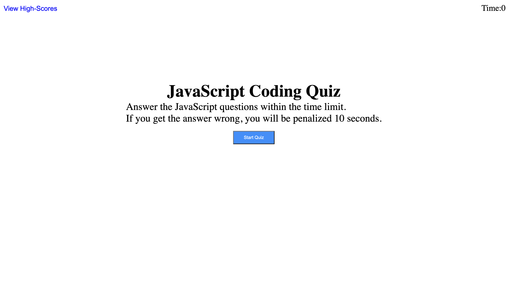

# JavaScript Fundamentals Quiz

## Description
My task was to create a quiz focused on JavaScript related questions that is timed, and keeps records of the users high scores and initials so
the user can gauge his/her progress compared to the users peers. I've learnt so much from this project, one of my biggest challenges I faced in this project
was learning to use the local storage! But I think with time and practice it will become second nature. 

## User Story

```
AS A coding boot camp student
I WANT to take a timed quiz on JavaScript fundamentals that stores high scores
SO THAT I can gauge my progress compared to my peers
```

## Acceptance Criteria

```
GIVEN I am taking a code quiz
WHEN I click the start button
THEN a timer starts and I am presented with a question
WHEN I answer a question
THEN I am presented with another question
WHEN I answer a question incorrectly
THEN time is subtracted from the clock
WHEN all questions are answered or the timer reaches 0
THEN the game is over
WHEN the game is over
THEN I can save my initials and my score
```

## ScreenShot

Link to deployed site: https://garciajv86.github.io/javascript_fundamental_quiz/



## Features

1. In the top left corner the user can click the view High Scores to view high scores
2. If the user wants to  restart the quiz user can click the go back button
3. If the user wants to clear the high scores then in the view high scores section the user can click the clear high scores button
4. Has start quiz button

## Authors

Joshua Garcia

## Contributors

Joshua Diehl